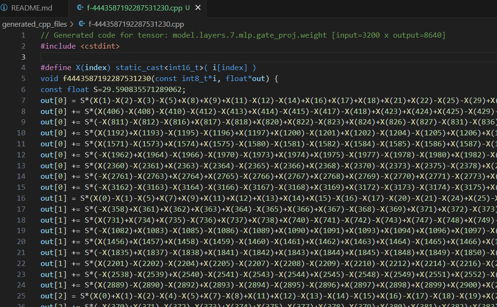

# Quantized Weight C++ Code Generator

This Python project automates the generation of C++ code for neural network models by quantizing the weights stored in safetensors files. It reads the model weights, quantizes them into ternary values (-1, 0, 1), calculates the scale factor for each weight tensor, and generates C++ code that utilizes these quantized weights for matrix operations. This approach is particularly useful for optimizing model inference on platforms where low precision computations are beneficial.



## Features

* Reads model weights from a safetensors file.
* Quantizes weights to ternary values (-1, 0, 1) and computes a scale factor.
* Generates C++ files for each tensor, naming them based on a hash of the tensor's name.
* Supports weights with both 1D and 2D dimensions.

## Requirements

* Python 3.6 or newer
* `safetensors` library
* `numpy` library

## Setup

1. Install Dependencies:

Ensure you have Python installed on your system. Then, install the required Python libraries by running:

```bash
git clone https://github.com/catid/bitnet_cpu.git
cd bitnet_cpu
conda create -n bitnet python=3.10 -y && conda activate bitnet
pip install safetensors numpy
```

2. Prepare Your Safetensors File:

Have your safetensors file ready. This file should contain the model weights you want to quantize and generate C++ code for.

Grab it from here: https://huggingface.co/1bitLLM/bitnet_b1_58-3B/

## Running the Project

To run the project and generate C++ code files for your model weights, follow these steps:

1. Place your safetensors file in a known directory.

2. Modify the file_path variable in the script to point to your safetensors file. For example:

```python
file_path = 'path/to/your/model.safetensors'
```

3. Run the script using Python:

```bash
python generate.py
```

Check the `generated_cpp_files` directory created by the script. This directory will contain the generated C++ files, one for each tensor in your safetensors file. The files are named based on a hash of the tensor's name to ensure uniqueness.

## Generated C++ Code Usage

Build with gcc:

```bash
time g++ -O3 -march=native -mtune=native -o output_file generated_cpp_files/f2748699528165131403.cpp
```

The generated C++ files define functions that accept an int8_t* input array and produce output through a float* output array.

The input size, output size, and operation logic within each function are tailored based on the quantized weights of the tensors.

To use these functions, include the generated C++ files in your C++ project, and call the functions as needed, providing the appropriate input and output arrays.

## Notes

Code is based on math utils file from the model: https://huggingface.co/1bitLLM/bitnet_b1_58-3B/blob/main/utils_quant.py
